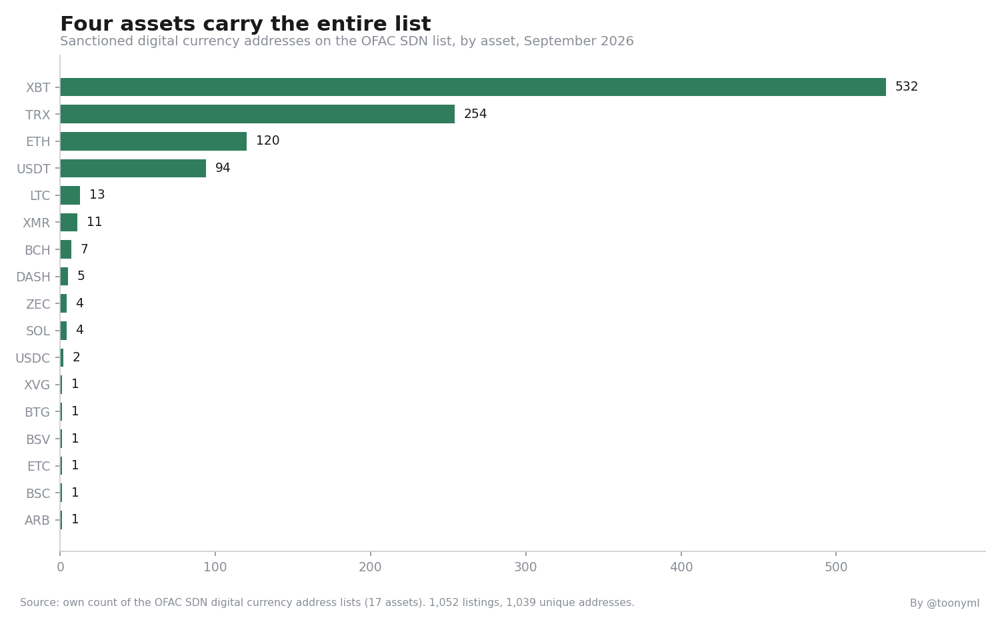
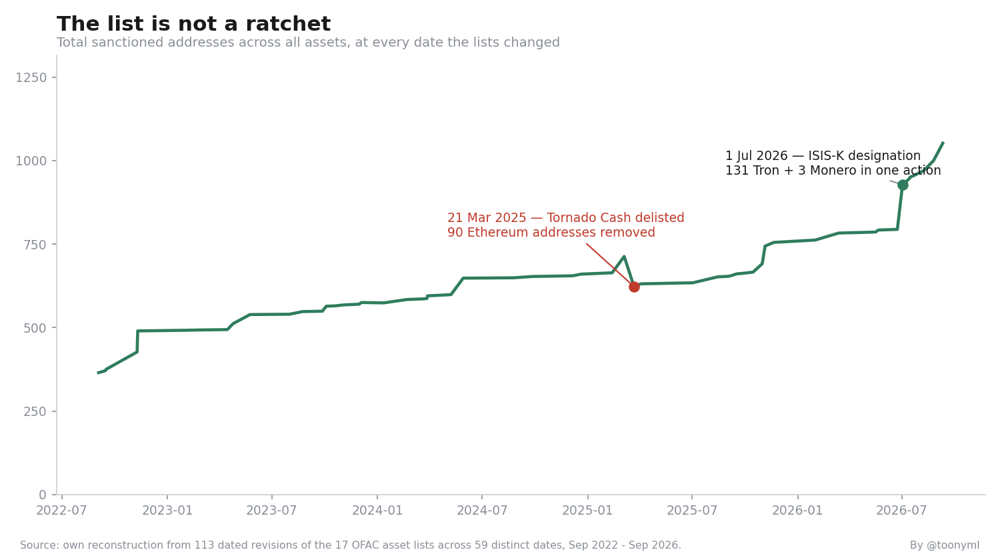
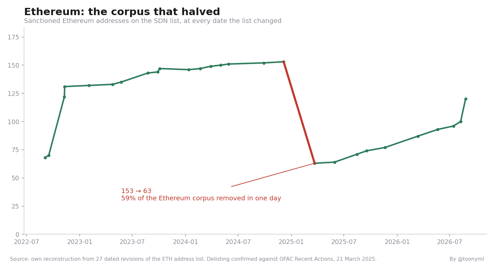
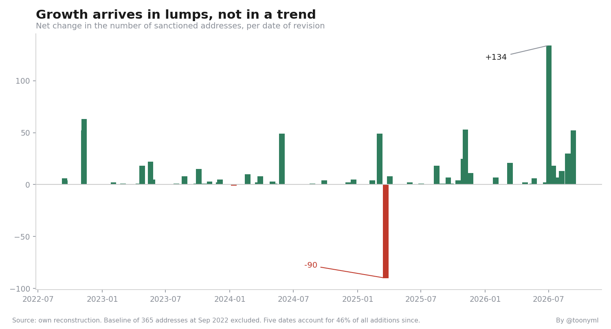

# OFAC crypto address corpus — dataset, analysis and a screening gap

The US sanctions list of digital currency addresses is public, and almost nobody has counted it. This repository is that count, plus the historical series behind it, and a screening script that demonstrates one structural problem the count exposes.

Everything here is reproducible from the CSVs in `data/`. No figure in this README was copied from an article.

## The findings

**The list is four assets wearing a coat of seventeen.** 1,052 address listings across 17 assets. Bitcoin 532, Tron 254, Ethereum 120, Tether 94 — together 95.1%. Six assets contain exactly one address each.

**The corpus is not a ratchet.** It grew from 365 listings in September 2022 to 1,052 in September 2026, but it has fallen twice. On 22 March 2025 the Ethereum list dropped from 153 to 63 — 59% of the Ethereum corpus removed in one day, following the delisting of Tornado Cash after the Fifth Circuit's ruling in *Van Loon*.

Screening built on the assumption that designations only accumulate — cached blocklists, one-way flags, historical hits that are never revisited — keeps blocking addresses that are no longer sanctioned.

**Growth arrives in lumps.** Five dates account for 45.5% of every address added since the September 2022 baseline. The largest single change is +134 on 2 July 2026 (131 Tron, 3 Monero), which matches the publicly described action for that date exactly — an independent check on this dataset rather than a restatement of it.

**The list is asset-scoped. Blockchains are not.** Of 1,039 unique addresses, only 10 appear under more than one asset. On Bitcoin that is unambiguous. On EVM chains it is not: the same key controls the same `0x` address on Ethereum, Arbitrum, BNB Chain, Base and Polygon, whether or not the designation named them.

That last point is what `scripts/screen.py` exists to show.

## The screening gap

```bash
python scripts/screen.py examples/transactions_sample.csv examples/sanctioned_addresses_sample.csv
```

```
Transactions screened : 7
Hits                  : 6
  EXACT              3
  CROSS_CHAIN_EVM    3

3 of these would be missed by an address+asset matching rule.
Escalate them; do not auto-clear on the basis that the asset differs.
```

Matching on address *and* asset feels more precise. It is quietly narrower than the designation: it clears the same sanctioned key the moment it appears on a chain the SDN entry did not happen to name. The script separates the two match types so the difference is visible rather than assumed.

Sample data is synthetic. Point the script at the real list and a real transaction export to use it.

## Reproducing the analysis

```bash
python scripts/analyze.py
```

Recomputes every number above from `data/`: composition, concentration, the full corpus timeline, both net decreases, the largest additions, and the Ethereum drop.

## Data

`data/corpus_by_asset.csv` — current listings per asset, with share of total.

`data/corpus_timeseries.csv` — 113 observations across 59 dates, September 2022 to September 2026: for each asset, the number of addresses on its list at every date that list changed.

The second file is the part that does not exist elsewhere in this form. It was reconstructed by retrieving each dated revision of the published lists and recounting it, rather than by reading the current list and assuming everything in it was added monotonically.

## What this does not contain

- **Attribution.** The address lists carry no entity or programme labels, and the full SDN XML was not parsed. Where this README names a case, that context comes from public reporting on the corresponding action, not from this dataset.
- **Any on-chain activity.** Nothing here concerns balances, flows, or whether a listed address has moved value.
- **Anything before September 2022.** The 365 listings present at the first observation are a baseline, not a first designation.
- **Legal advice.** A hit from `screen.py` is an item to escalate to a compliance owner. It is not a determination.

## Method

Current lists: the published address list for each of the 17 covered assets, counted directly; duplicates resolved by lowercasing and comparing address strings.

Historical series: for each asset list, every dated revision retrieved and the listing count recomputed at that revision.

Event checks: the two largest movements were compared against OFAC Recent Actions and contemporaneous reporting. Direction and magnitude agree in both cases.

Figures are a snapshot. The list changes; rerun the analysis against a fresh pull before relying on any number here.

## Licence

MIT.

## Charts









Regenerate: the charts are produced from the same CSVs as `analyze.py`.
